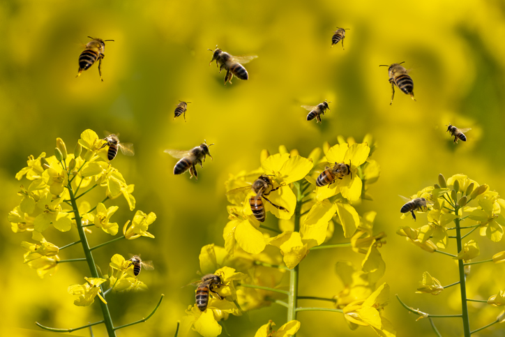

# Project: Creating Pollinator Bee-Friendly Spaces

## Background

You work for the local government environment agency and have taken on a project about creating pollinator bee-friendly spaces. You can use both native and non-native plants to create these spaces and therefore need to ensure that you use the correct plants to optimize the environment for these bees. The team has collected data on native and non-native plants and their effects on pollinator bees. Your task will be to analyze this data and provide recommendations on which plants create an optimized environment for pollinator bees.

## Data

The project team has collected data on native and non-native plants, as well as their impact on pollinator bees. This data serves as the foundation for analyzing and providing recommendations on which plants are most suitable for creating a favorable environment for pollinator bees.

## Objectives

The primary goals of this project are as follows:

1. Identify plant preferences: Analyze the data to determine which plants are preferred by native and non-native bee species.

2. Visualize species distribution: Create a visualization showcasing the distribution of bee and plant species within one of the samples.

3. Recommend top plant species: Select the top three plant species to recommend to the agency for supporting native bees.

## Analysis and Recommendations

### Plant Preferences by Native vs. Non-Native Bee Species

Through data analysis, it is essential to discern the plant preferences of native and non-native bee species. By understanding their preferences, we can create a balanced and diverse environment for pollinator bees. This analysis will provide valuable insights into the plant species that are most attractive to each group, enabling effective planning and implementation of bee-friendly spaces.

### Visualization of Bee and Plant Species Distribution

To gain a comprehensive understanding of the distribution of bee and plant species, a visualization will be created. This visualization will depict the abundance and variety of bee and plant species within one of the samples. By visually representing this data, patterns and trends can be easily identified, helping us make informed decisions regarding plant selection and overall ecosystem design.

